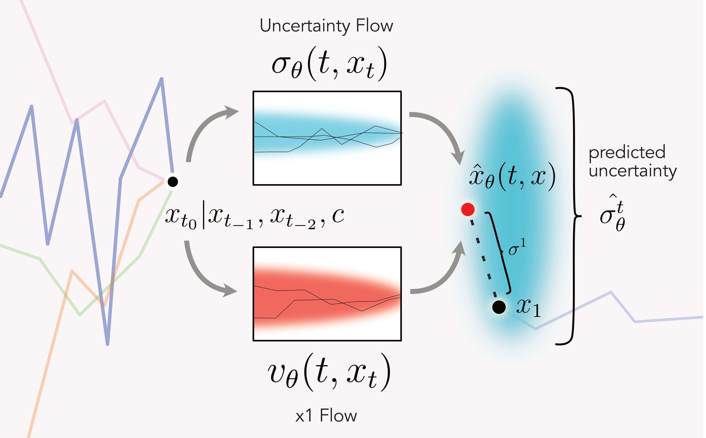

<div align="center">

# Trajctory Flow Matching
<!-- 

[x] TODO: check pytorch, lightning versions, if we want to include those

[x] TODO: check license -->

[](http://arxiv.org/abs/2410.21154)
[](https://pytorch.org/get-started/locally/) 
[](https://pytorchlightning.ai/) 
[](https://hydra.cc/)
[](https://opensource.org/license/mit) 
<a href="https://github.com/ashleve/lightning-hydra-template"></a>

</div>


## Description
Trajectory Flow Matching (TFM) is a method that leverages the flow matching technique from generative modeling to model time series. This approach offers a simulation-free training process, allowing for efficient fitting of stochastic differential equations to time-series data. Augmented with memory, time interval prediction, and uncertainty prediction, TFM can better model irregularly sampled trajectories with stochastic nature, for example clinical time series.

<p align="center">

</p>

The idea of TFM lies in using flow matching concept to predict both stochastic uncertainty and the next value in the time series. The prediction is conditioned on past data and conditional variables.


## How to run 
<!-- [x] TODO: check for details such as python versions

[ ] TODO: reflect potential changes to the repo name

[x] TODO: create requirements.txt -->

### Initialize environment
```bash
# clone project
git clone https://github.com/nZhangx/normalizing_flow_time_series.git
cd normalizing_flow_time_series

# [OPTIONAL] create conda environment
conda create -n tfm python=3.10
conda activate tfm

# install requirements
conda env create -f environment.yml
```

### Run experiments
Under `lightning`, define `DATA.yml` in `conf/data` and `MODEL.yml` in `conf/model` with desired configurations. The default setting runs TFM with a toy dataset with the same headings.
```bash
python src/main.py
```

### Implemented models
<!-- [ ] TODO: check; copied from "4 Experimental Results - Baseline" section in the manuscript -->
- TFM and ablations (size ablated, uncertainty ablated)
- Aligned Flow Matching [[Liu et al., 2023](https://arxiv.org/abs/2302.05872)][[Somnath et al., 2023](https://arxiv.org/abs/2302.11419)]
- NeuralODE [[Chen et al., 2018](https://arxiv.org/abs/1806.07366)]
- NeuralSDE [[Li et al., 2020](https://arxiv.org/abs/2001.01328)] [[Kidger et al., 2021](https://arxiv.org/abs/2102.03657)]
- LatentODE [[Rubanova et al. 2019](https://arxiv.org/abs/1907.03907)]

|                               | ICU Sepsis                 | ICU Cardiac Arrest         | ICU GIB                    | ED GIB                      |
|-------------------------------|----------------------------|----------------------------|----------------------------|-----------------------------|
| NeuralODE                     | 4.776 $\pm$ 0.000          | 6.153 $\pm$ 0.000          | 3.170 $\pm$ 0.000          | 10.859 $\pm$ 0.000          |
| FM baseline ODE               | 4.671 $\pm$ 0.791          | 10.207 $\pm$ 1.076          | 118.439 $\pm$ 17.947       | 11.923 $\pm$ 1.123          |
| LatentODE-RNN                 | 61.806 $\pm$ 46.573        | 386.190 $\pm$ 558.140      | 422.886 $\pm$ 431.954      | 980.228 $\pm$ 1032.393        |
| **TFM-ODE (ours)** | **0.793 $\pm$ 0.017** | 2.762 $\pm$ 0.021          | 2.673 $\pm$ 0.069          | **8.245  $\pm$ 0.495** |
||
| NeuralSDE                     | 4.747 $\pm$ 0.000          | 3.250 $\pm$ 0.024          | 3.186 $\pm$ 0.000          | 10.850 $\pm$ 0.043          |
| **TFM (ours)**     | 0.796 $\pm$ 0.026          | **2.755 $\pm$ 0.015** | **2.596 $\pm$ 0.079** | 8.613 $\pm$ 0.260           |


### Available datasets
<!-- [ ] TODO: how to share the datasets? create a folder in the repo and upload the eICU and MIMIC pickle files? -->
We plan to share the clinical data we used that are from the [eICU Collaborative Research Database v2.0](https://physionet.org/content/eicu-crd/2.0/) (ICU sepsis and ICU Cardiac Arrest) and the [Medical Information Mart for Intensive Care III (MIMIC-III) critical care database](https://physionet.org/content/mimiciii/1.4/) (ICU GIB) on [Physionet](https://physionet.org/).

## How to cite

This repository contains the code to reproduce the main experiments and illustrations of the preprint [Trajectory Flow Matching with Applications to
Clinical Time Series Modeling](https://arxiv.org/abs/PLACEHOLDER). We are excited that it was marked as a **spotlight** presentation.

If you find this code useful in your research, please cite (expand for BibTeX):

<details>
<summary>
bibtex citation
</summary>

```bibtex
@article{TFM,
	title        = {Trajectory Flow Matching with Applications to Clinical Time Series Modelling},
	author       = {Zhang, Xi and Pu, Yuan and Kawamura, Yuki and Loza, Andrew and Bengio, Yoshua and Shung, Dennis and Tong, Alexander},
	year         = 2024,
	journal      = {NeurIPS},
}
```
</details>


## License
This repo is licensed under the [MIT License](https://opensource.org/license/mit).
